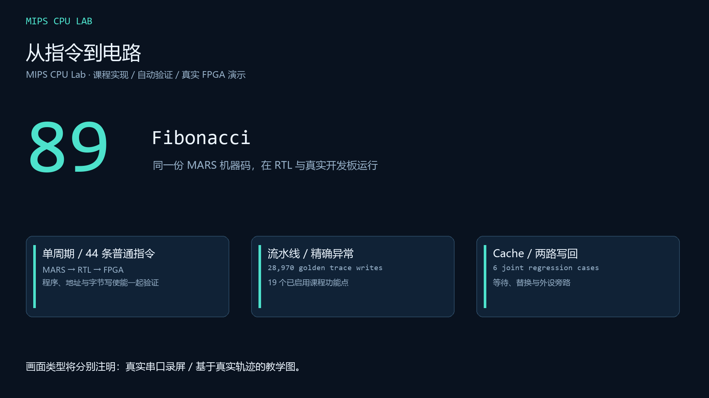
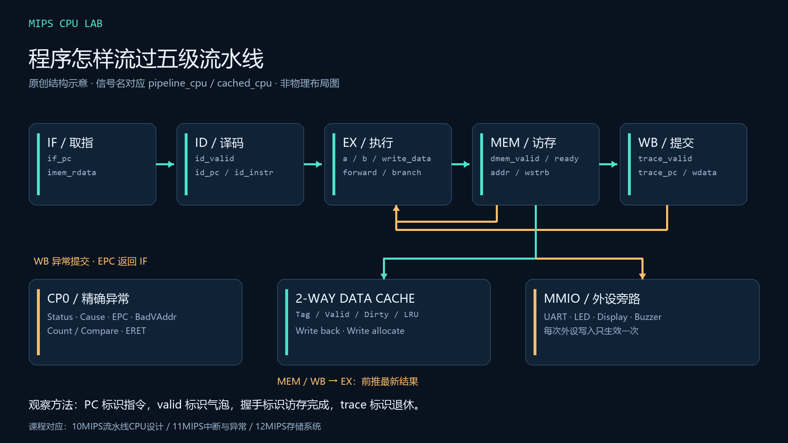
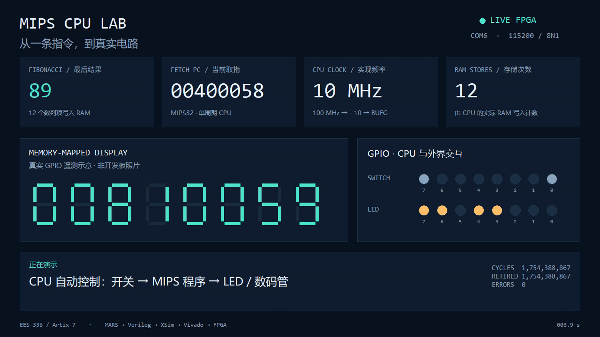

# MIPS CPU Lab · 从指令到电路



围绕北理工课程资料，从 MIPS 汇编、单周期 CPU，走到五级流水线、精确异常、
两路 Cache 和真实 FPGA。代码、预期结果、仿真轨迹与实板串口证据分别保留，
便于学习、汇报和复现。

**单周期 SoC 已在 EES-338 / XC7A35T 上运行，流水线与 Cache 已通过联合仿真。**
本项目不是完整 MIPS32 实现，也不把历史项目的 README 当作 2026 验收标准。

[▶ 观看 78 秒中文演示](media/mips-cpu-demo.mp4) ·
[下载演示与 bitstream](https://github.com/wohuishuo/mips-cpu-lab/releases/tag/v0.1.1) ·
[实验报告](docs/report.md) / [PDF](docs/report.pdf) · [课程讲解](docs/teaching.md) ·
[12 项能力与证据](docs/capabilities.md) · [完整复现](docs/reproduce.md)

## 已验证的结果

| 路径 | 实际结果 |
|---|---|
| MARS → 单周期 RTL | 同一汇编程序的 12 个 Fibonacci 值逐项一致，最后为 89 |
| 单周期核 | 44 条普通指令，2,113 项检查；显式延迟槽、PC+8 链接 |
| 五级流水线 | 三种存储等待模式，各 494 次独立退休对照；13 次真实异常处理 |
| CP0 | 25 项检查，包含 Count/Compare 写入边界和中断 |
| CPU + Cache | 2 种配置 × 3 种等待模式；每组 391 次退休、198 次 CPU 事务、8,192 个后备存储字一致 |
| 课程 lab1 / lab3 | 两版显示各 672 项检查；原 Fibonacci 的 20 个 RAM 值；原加法程序及 36 组边界输入 |
| 原 teach_soc + 流水线 | 28,970 行 golden trace 一致，420 次实际存储；本地镜像启用 19 个功能点 |
| GNU 源码重建 | 实际预处理、汇编、链接和 COE 转换；46,951 个 ROM 字与原件完全一致，新镜像重跑原 golden 通过 |
| 实板 | 10 MHz 单周期 SoC；12 次 RAM 存储、89、错误计数 0；UART 控灯和 CPU 重启通过 |
| FPGA 实现 | 2,858 LUT、1,865 FF；setup 余量 8.582 ns，hold 余量 0.011 ns；DRC 0 |

完整机器记录见 [evidence/results.json](evidence/results.json) 和
[实板记录](evidence/board.json)。仓库提供 [CI 模板](docs/ci/README.md)，本次发布
因 GitHub 授权缺少 workflow 权限，没有启用 Actions；Python 编排检查与
Vivado/XSim 回归均在本地实际运行。

## 看懂这台 CPU



从 [六个组成原理问题](docs/teaching.md) 开始：一条指令怎样改变状态、
为什么要对照完整存储地址、延迟槽怎样工作、流水线怎样暂停、异常怎样精确、
为什么 MMIO 要绕过 Cache。[课件对照](docs/course-map.md) 列出本地老师 PDF 的
标题与页码；公开仓库使用原创讲解和图，不再分发教师课件或教材扫描件。



这是读取真实 FPGA UART 的窗口录屏。数字和 LED 图形由遥测绘制，
画面内明确标注，**不是开发板照片**。影片包含实际控灯、蜂鸣器触发命令和重启。
板上数码管外观、LED 物理方向和蜂鸣器实际声音仍需单独现场观察；当前没有这些
光学/声学证据。[图片、裁图与素材说明](media/README.md)

## 运行

需要 **Vivado / XSim 2019.2、Python 3.10+、Java 和 MARS 4.5**。
这些工具通过命令行驱动，本项目不依赖专用 Vivado MCP。串口测试另需 pyserial。

```powershell
$env:VIVADO_BIN = 'C:/Xilinx/Vivado/2019.2/bin'
$env:MARS_JAR = 'C:/tools/mars4_5.jar'
python scripts/run_all.py
```

基础入口顺序运行 8 套回归。具备本地课程原件时，再设置 `BITMIPS_ROOT`、
`BITMIPS_LAB5`，使用 `--with-course` 运行全部 11 套。
缺少原件会明确记为 `SKIP`，不会冒充通过。板卡构建、下载和串口测试是显式步骤，
详见 [复现说明](docs/reproduce.md)。

## 代码地图

| 路径 | 内容 |
|---|---|
| `rtl/core/` | 单周期核、五级流水线、CP0 |
| `rtl/cache/` | 两路、写回、写分配 Cache |
| `rtl/peripherals/` | UART、数码管、蜂鸣器、命令控制器 |
| `rtl/soc/` | 已下板的单周期 SoC 与 EES-338 顶层 |
| `rtl/integration/` | CPU/Cache 联合与本地课程工程适配 |
| `tests/` | 独立参考、断言、负例和 XSim 运行器 |
| `software/` | 原创汇编与明确编码的测试镜像 |
| `constraints/` | 根据实际 EES-338 文档重新核对的 XDC |
| `ip/uart_control/` | 已封装并在新项目重新调用的自写 UART IP |
| `scripts/` | 汇编、回归、构建、下载、实板测试、媒体制作 |
| `docs/` / `evidence/` / `media/` | 报告、实测数据与演示 |

已有学生项目经过阅读和缺陷探测后用于结构参考，未直接导入旧 XPR/XDC。
来源、版本和分发边界见 [THIRD_PARTY.md](THIRD_PARTY.md)。本仓库原创代码采用 MIT。
