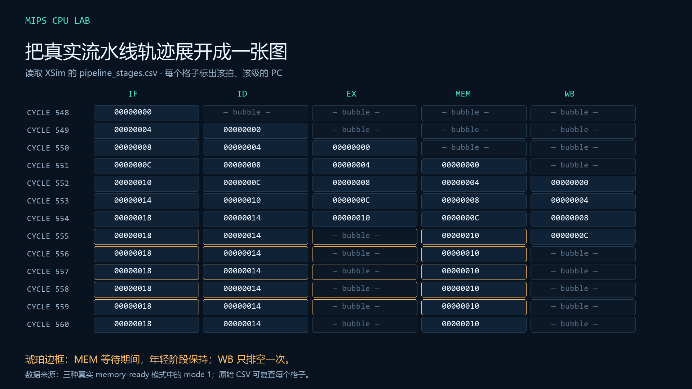
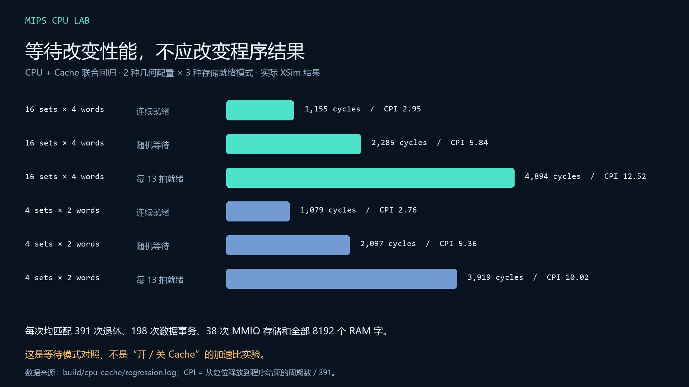

# MIPS CPU 设计、验证与 FPGA 演示报告

本项目用一条可追踪的证据链串起计算机组成原理：汇编定义预期行为，RTL 在
时钟边沿更新状态，独立参考检查退休与存储，布局布线检查电路时序，最后通过
真实串口验证已经下载到 EES-338 的单周期 SoC。

单周期、流水线和 Cache 使用同一组基本规则：32 位寄存器、字节地址、小端字节
布局、不可写的零寄存器、一个显式分支延迟槽、JAL/JALR 的 PC+8 链接。
异常语义有意不同：单周期参考核采用确定的错误抑制与算术环绕；流水线提供
文档限定的精确异常和 CP0。报告中的比较不会掩盖这一区别。

## 1. 资料与设计选择

先清点本地课程目录、提取 PDF 文本并检查源代码与历史工程。旧项目可能具有
错误引脚、失效路径或已知逻辑缺陷，因此根据其模块组织理解任务，再实现和
验证自己的 RTL。历史报告只用于章节组织；本地没有独立的 2026 正式评分表。

课程主线对应 [课件映射](course-map.md)：单周期的数据通路与控制，流水线的
相关和暂停，CP0 的异常状态，Cache 的地址划分与写回。最终拆成
[12 项从输入到验证的能力](capabilities.md)。工具使用实际已运行的 Vivado/XSim
2019.2、Python 3.12、Java/MARS 4.5；媒体使用 FFmpeg、Pillow 和本地中文语音。

## 2. 单周期：让程序真正改变内存


`single_cycle_cpu` 将取指、译码、执行、访存和写回放在一拍内完成。对 `lw`，
ALU 先求有效地址，再读取组合 RAM，最后写回寄存器。这条长路径决定时钟约束。
板级设计使用 100 MHz 输入、除十后的 10 MHz CPU 时钟和 BUFG；按布局布线后的
实际余量选择频率，而不是把仿真中的时钟周期当成芯片性能。

44 条普通指令的测试包括负立即数、有符号/无符号比较、移位、字节/半字访问、
分支、跳转与链接。2,113 项检查不仅看最后结果，还看 PC、目标寄存器、写回值
和存储字节使能。MARS 实际运行同一 Fibonacci 汇编生成 12 个预期结果：

```text
0, 1, 1, 2, 3, 5, 8, 13, 21, 34, 55, 89
```

RTL 必须依次写入正确的完整地址。把高位地址改错的变异会失败，避免只有低位
RAM 索引相同就误判通过。板级程序随后把第十二项从 RAM 重新加载到显示寄存器；
UART 的末项遥测另外取自真实 RAM 写入观察值。

## 3. 流水线：重叠执行仍要保持顺序



`pipeline_cpu` 显式保留 IF/ID/EX/MEM/WB 的有效位、PC、指令。较新的 MEM 结果
优先前推到 EX，之后才考虑 WB。load-use 产生气泡；存储器未就绪时保持年轻级，
WB 排空一次。请求必须在 valid 与 ready 同时有效的边沿才完成，不能在每个
等待拍重复写外设或重复退休。

三种内存等待模式各检查 494 次退休。独立软件模型给出预期的 PC、指令、寄存器
写回和访存结果。测试覆盖相邻依赖、存储数据前推、延迟槽、错误冲刷及复位；
另外在 CPU/Cache 联合程序检查正常的有符号 ADD/ADDI/SUB。

这里的阶段图来自真实 XSim CSV，每一格是实际 PC。它展示等待如何产生保持，
不是手绘一条看似合理却没有运行过的时序。

## 4. 精确异常与 CP0

异常指令不提交错误状态，较老指令完成，较年轻指令被清除。CP0 保存 Status、
Cause、EPC、BadVAddr，以及 Count/Compare 等教学子集寄存器。延迟槽异常设置
BD 并记录所属分支的 EPC；ERET 清除 EXL 并回到 EPC。

外部中断在安全的非延迟槽 EX 边界接受。测试专门安排中断撞上等待中的老存储，
要求老存储完成一次、年轻指令没有副作用。流水线实际执行 13 次异常处理流程，
独立 CP0 测试包含 25 项检查。

审查中曾发现 Count 写入的边界：Count 原为 99、Compare 为 100，软件把 Count
写成 0，不能用旧 Count+1 误触发中断。修复后比较真正提交的 Count 下一值，
并验证 Compare 写入清除中断的优先级。这一反例保留在测试中。

## 5. Cache 与性能



Cache 为两路组相联、写回、写分配，使用 Valid/Dirty/Tag/LRU。脏行替换先写回
再回填，字节使能只合并被选中的字节。非法零值或非二次幂参数在仿真开始时拒绝。
外设位于单独旁路窗口，避免把有副作用的写入留在 Cache 中。

| 组数 × 每行字数 | 等待模式 | 周期 | CPI（391 次退休） | hit / miss / writeback |
|---|---|---:|---:|---|
| 16 × 4 | 连续就绪 | 1,155 | 2.95 | 103 / 56 / 24 |
| 16 × 4 | 随机等待 | 2,285 | 5.84 | 103 / 56 / 24 |
| 16 × 4 | 每 13 拍就绪 | 4,894 | 12.52 | 103 / 56 / 24 |
| 4 × 2 | 连续就绪 | 1,079 | 2.76 | 66 / 93 / 29 |
| 4 × 2 | 随机等待 | 2,097 | 5.36 | 66 / 93 / 29 |
| 4 × 2 | 每 13 拍就绪 | 3,919 | 10.02 | 66 / 93 / 29 |

六组各有 198 次 CPU 事务、38 次 MMIO 存储，8,192 个后备 RAM 字最终逐一一致。
地址访问集合相同，所以同一结构在不同等待模式下命中计数不变。
较小 Cache 在这里可以因传输的行更短而少耗周期；这个小程序不能证明它普遍更快。
表中没有无 Cache 基线，因此不计算“Cache 加速比”。

## 6. 课程工程的实际集成

lab1 同时测试自写显示实现和本地原框架补全副本，各 672 项输出断言；原文件保持
不变。lab3 直接编译原顶层和 confreg，并按原 XCI 的异步 distributed memory
契约建模。原 Fibonacci 得到全部 20 个 RAM 值、末项 17711；原加法实际运行
4,000,276 个周期验证 255+255。另有明确加速等待常数的版本检查所有显示与 36
组输入边界。[详细范围](course-basics.md)

lab5 使用本地供应的 COE 与 golden trace，并直接编译原 teach_soc、bridge、
confreg。自写适配器对半拍时序作显式仿真衔接，得到 28,970 行写回匹配、420 次
存储，完成时显示 0x13000013、LED 0x0F。EOF 之后继续验证结束循环，错误、
截断或额外 trace 都会失败。[详细接口](teach-soc.md)

随后在隔离 Ubuntu 环境中实际完成 GNU 重编译，使用 GCC 12.4.0、Binutils 2.42
和主机 GCC 13.3.0。只在构建副本补上 `-mfp32`、排除新增 ELF ABI 元数据，并从
原启动代码的 JAL 目标推导明确归档顺序，保持原函数地址。默认顺序的不同结果
另行保留。重建后全部 46,951 个 ROM 字与原 COE 一致，新镜像再次通过原 golden；
没有改写期望值来迎合 CPU。[构建步骤与证据](gnu-rebuild.md)

本地 `start.S` 只启用 19 个功能点，未声称全部 89 点通过。半拍适配器是仿真
兼容层，不代表原 teach_soc 已满足 FPGA 100 MHz 时序。

## 7. 从综合到真实 FPGA

已通过 JTAG 确认 XC7A35T，再按 EES-338 手册和原理图逐项核对新引脚。CPU、
UART、数码管、LED 和蜂鸣器集成为单周期板级 SoC。时序通过才产生成功标记，
该标记包含 bitstream SHA-256；下载前再次核对哈希，失败构建不能复用旧成功标记。

已下载镜像的实现结果：2,858 LUT（其中 512 LUT RAM）、1,865 FF，setup
余量 8.582 ns、hold 余量 0.011 ns、脉宽余量 4.500 ns、DRC 0、无未约束内部端点。
这些数值对应 10 MHz 单周期 SoC，不能移用到流水线或 CPU/Cache 的板级性能声明。

串口 115200/8N1 返回固定 40 字节包。实测开关字节 0x81、显示寄存器 0x00810059，
CPU 控制时 LED 驱动值 0xD8。命令 `0/1/a` 分别强制关灯、开灯、交还 CPU，
`r` 复位后重新计算，`b` 触发蜂鸣器。每次板测开头失效旧结果，重启验证同时
限制计数器年龄，避免自然回绕被误认为复位。

## 8. 演示与复现

[78 秒中文影片](../media/mips-cpu-demo.mp4) 分为封面、通路、实板串口、流水线
轨迹和 Cache 结果五段。20–52 秒是实际窗口录屏；本地合成中文旁白介绍其余
原创教学图。裁图保留来源说明，不把数字仪表盘当作开发板照片。

干净克隆已实际完成完整 11 套回归和 ROM→综合→布线→bitstream 重建。
回归记录绑定运行时的 Git 提交，而不是导出报告时可能已经前进的 HEAD。
独立审查覆盖核、Cache、外设、SoC、课程适配与编排脚本；修复包含 MMIO 页别名、
Count 边界、旧成功标记和复位断言过弱等问题。

学习者可按 [复现步骤](reproduce.md) 重新产生日志；准备汇报时按
[六个教学问题](teaching.md) 展开，每个结论指回代码或实际测试。
当前没有开发板外观录像和蜂鸣器现场录音，实际发光方向、数字可见外观与声音
仍需现场观察。它们作为剩余证据明确保留，不写成已完成的实物观察。
