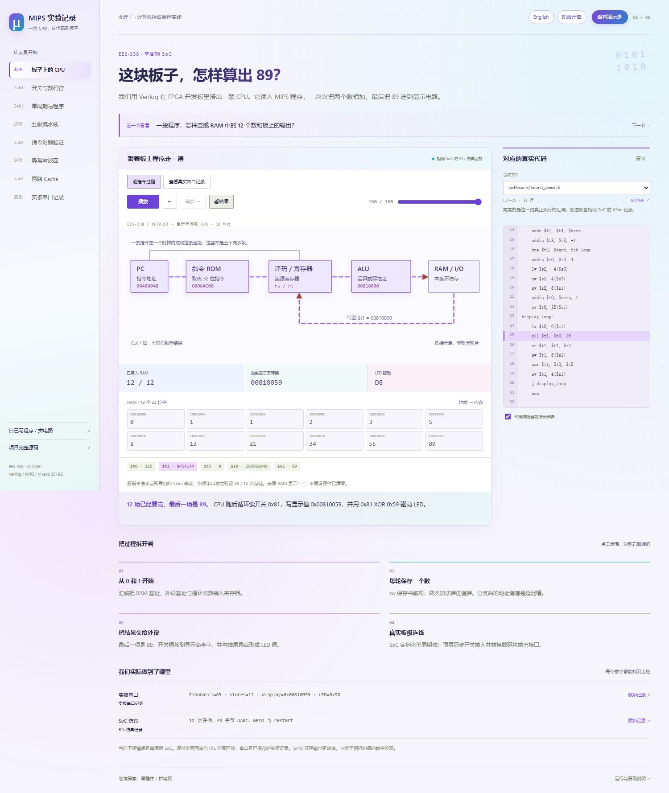

# 项目讲解与 CPU 工坊

在线入口是 [GitHub Pages](https://wohuishuo.github.io/mips-cpu-lab/)，本地入口是 `http://127.0.0.1:4173/lab/`。页面以一节实验课的顺序呈现：先提出问题，
操作中间的图，观察状态，再看右侧高亮的真实源码。下方列出步骤与已经验证的结果。
点击「跟着演示走」可播放板上同一 SoC 的关键执行步骤，也可以暂停、回退、拖动周期。



## 八个讲解章节

| 章节 | 直接操作 | 数据来源 |
|---|---|---|
| 板子上的 CPU | 单步指令、看寄存器和 RAM、查看显示输出 | 与下板相同的单周期 SoC，新运行的 160 拍 XSim 记录；实板串口另页签 |
| lab1 开关与数码管 | 拨开关、捕获一个字节、改变扫描相位 | 浏览器原理模型，旁边对照实际适配器与扫描代码 |
| lab3 单周期与程序 | 计算 20 项 Fibonacci、输入两个 8 位数相加 | 算法交互与课程 RTL 验证记录；课程序列从 2、3 开始，板上从 0、1 开始 |
| 五级流水线 | 拖动周期、切换三种存储等待模式 | 3,801 行真实 RTL 阶段 CSV |
| lab5 指令对照验证 | 注入一个错误，定位第一处写回差异 | 三行教学例子；实际 28,970 行、19 个启用点的回归证据另列 |
| 异常与返回 | 跟随异常进入、保存 EPC、处理、eret；切换延迟槽 | CP0 原理演示与实际 RTL 源码，真实回归单独标明 |
| lab7 两路 Cache | 读、写、访问同组地址，观察脏行写回 | 浏览器功能模型；两种配置 × 三种等待模式的 RTL 证据另列 |
| 实板串口记录 | 回放关灯、开灯、恢复自动、重启记录 | 已保存的实际 UART 结果，不向板卡发送命令 |

当前材料实际提供 lab1 / lab3 / lab5 / lab7。单周期 SoC 有下板记录；流水线、
CP0 和 Cache 按仿真验证范围展示。数码管和 LED 是逻辑示意，不是板卡照片。
代码包保留 37 个仓库源文件的内容、行号和摘要，不分发教师 ROM、golden 或课件。

## 自己写程序与拼电路

目录底部或页脚的「写程序 / 拼电路」进入 `lab/playground.html`，保留原来的
五级软件 CPU、汇编编辑器、寄存器/内存、全加器和可拼接门电路。它与项目讲解使用统一的浅色界面。
以下五项能力与操作路线均指这个浏览器实验台；CUSTOM 没有加入 FPGA RTL。

## 启动与软件

安装 Node.js，在仓库根目录运行：

```powershell
npm run lab
```

打开终端显示的地址即可。静态文件完全本地计算，无 CDN、登录或网络服务依赖；服务只监听本机。运行不需要 Vivado、MARS 或专用 MCP。若已有静态 Web 服务，也可以直接服务 `docs/`；原生 ES modules 需要 HTTP，因此不要双击 HTML 用 `file://` 打开。

真正修改、综合和验证本仓库 FPGA 工程时，仍使用 Vivado / XSim 2019.2。浏览器模型不替代 Verilog 回归与实板测试。

## 五个垂直 capabilities

| 能力 | 从哪里开始 | 可以看到什么 | 可验证结果 |
|---|---|---|---|
| V01 输入到结果 | A/B 与汇编编辑器 | 汇编错误行、指令、寄存器输入 | 默认 7 + 5 写入 RAM[0] = 12，后续结果 RAM[4] = 17 |
| V02 指令到流水线 | 运行、暂停、时钟单步、回退 | IF/ID/EX/MEM/WB、阶段信号、转发、load-use、等待 | 增加存储等待后周期增加，结果不变且无重复副作用 |
| V03 结果到状态 | 寄存器 / RAM 面板 | 32 寄存器、256 字节小端 RAM、写入高亮 | 字节示例把 0x12345678 改为 0x1234AB78 |
| V04 运算到逻辑门 | 位选择条、全加器展开 | A/B/Cin、两级 XOR、AND/OR、Sum/Cout | 0xFFFFFFFF + 1 的最高位输出 carry=1，32 位结果为 0 |
| V05 元件到 CPU | 电路工坊 | 拖动门、端口连线、输入开关、DFF、关卡、导入导出 | 安装 32 位 A/B/Y 网络后，CUSTOM 指令使用该电路计算 |

## 操作路线

1. 默认示例输入 7 和 5，点击「加载程序与输入」。单步看到 PC 逐条进入流水线。
2. 点 EX 模块查看操作数与结果，点 MEM 查看地址。时序表里每一列是一个真实模型时钟；保持在同一级的指令有停顿标记。
3. 切到 RAM 查看地址 0 和 4。运行结束仍可回退，寄存器、RAM 和级间状态一起恢复。最多保留最近 600 拍；轨迹保存最近 100 拍、显示最近 18 拍。
4. 「展开到一位」默认跟随最近一次 CUSTOM 的 A/B。也可直接改输入，单独研究 32 位加法的每一个进位。
5. 在电路工坊选择示例，先点输出端口再点输入端口连线。32 位组合网络需要命名接口 A、B、Y；安装后 CPU 复位，下一次 CUSTOM 使用新网络。

快捷键：空格运行/暂停，N 前进一个时钟，B 回退。输入框和按钮获得焦点时不触发全局快捷键。选择其他模式会暂停 CPU。

## 软件模型边界

支持 44 条普通 MIPS 指令：ADD/ADDU/SUB/SUBU/ADDI/ADDIU；SLT/SLTU/SLTI/SLTIU；AND/OR/XOR/NOR/ANDI/ORI/XORI/LUI；SLL/SRL/SRA/SLLV/SRLV/SRAV；BEQ/BNE/BLEZ/BGTZ/BLTZ/BGEZ/BLTZAL/BGEZAL；J/JAL/JR/JALR；LB/LBU/LH/LHU/LW；SB/SH/SW。接受 LI、MOVE、NOP，以及浏览器扩展 HALT 和 CUSTOM。

一个分支延迟槽、PC+8 链接、32 位无符号保存、带符号比较和扩展、小端字节寻址参与计算。流水线有真实有效级、转发、load-use 气泡、存储等待；快照显示上升沿后的锁存器，位于 WB 的指令在下一拍提交。MEM 完成时更新 RAM。循环的每次动态取指有不同编号。

ADD/ADDI/SUB 溢出、非法地址/对齐、延迟槽内再次控制转移会停止模型并报告错误；这是教学错误处理，不是精确 CP0 异常。UI 在出错时恢复该拍之前的状态。无 CP0、Cache、中断、乘除法/HI-LO、板级外设或传播延迟模拟。

**CUSTOM 为浏览器可替换组合单元，没有加入 FPGA RTL。** 默认是 ADD32，可切换为 XOR32 或自行搭建组合门网络。时钟 DFF 可在电路工坊学习，但不允许安装到组合 CUSTOM 接口。全加器展开区始终展示 ADD32 的内部结构，其他网络的实际结构与信号看电路工坊。

线的颜色标记逻辑值或阶段活动，动画表示逻辑传递，不声称电压、电流、纳秒时序或实际晶体管仿真。旧 `evidence/` 中的 RTL/实板结果与此软件模型分别记录。

## 开发和验证

```powershell
npm run test:visual
npm run test:exhibit
python -m unittest tests/test_run_all.py -v
```

引擎测试使用 Node 自带 test runner，无第三方依赖。浏览器回归另需 Playwright，先启动本地服务：

```powershell
npm install --no-save playwright
npx playwright install chromium
npm run test:browser
npm run test:exhibit:browser
```

已有 Edge 可设置 `$env:PLAYWRIGHT_CHANNEL = 'msedge'`。测试截图与结果写入被忽略的 `build/visual-lab/`；`PLAYWRIGHT_MODULE` 可指向已有 Playwright 包，`LAB_URL` 可指定其他服务器。

入口职责：`app.js` 管理交互与视图，`engine/cpu.js` 执行指令，`engine/circuit.js` 计算网表，`circuit-editor.js` 管理拼接。无需构建或打包即可修改并刷新。

[本次验证项目与范围](visual-lab-verification.md)

## 更新讲解数据

`npm run build:exhibit` 从仓库源码和 evidence 重新生成 `lab/data/project.json`，
统一文本换行，保留来源摘要与全部阶段/串口记录。修改对应源文件后应重新生成并运行测试。
`python scripts/export_exhibit_trace.py` 使用 MARS 和 Vivado / XSim 2019.2 编译并运行同一 SoC，
独立检查全部寄存器与 RAM 转移，再导出 `lab/data/board-trace.json`。设置 `MARS_JAR`
指向已有 MARS 4.5；该重建需要 FPGA 工具链，打开网站本身不需要。

讲解页截图和检查结果输出到 `build/exhibit/`。入口 `exhibit.js` 管理章节和代码跟随，
`exhibit-models.js` 计算显示与 Cache 原理交互；真实执行轨迹直接读记录，不由网页重新编造。

## 中英文与视觉效果

讲解页与电路工坊顶部均可切换中文 / English。`?lang=en` 或 `?lang=zh` 可分享指定语言，
跨页面链接、新标签页和刷新保留选择。语言切换不重置模拟状态，不改动输入程序或真实源码。
英文覆盖章节、操作结果、错误提示、辅助标签和电路工坊；代码窗口保持原文件，包括原注释。

页面使用彩色信号流、发光芯片、数码管与内存变化提示。顶部可关闭装饰动效，
也尊重系统的减少动态效果设置。连线动效用于讲解，不代表真实电子传播速度。

`npm run test:locale` 检查语言切换、状态与输入保留、八个章节和电路预设的英文、
辅助文字、移动端、减少动效设置。`locale.js` 只翻译展示文本，词典位于 `lab/i18n/`。

Pages 使用 `main` 的 `/docs` 目录；`.nojekyll` 直接发布静态模块与 JSON，
`docs/index.html` 把站点根入口转到实验讲解，保留查询参数和章节锚点。
