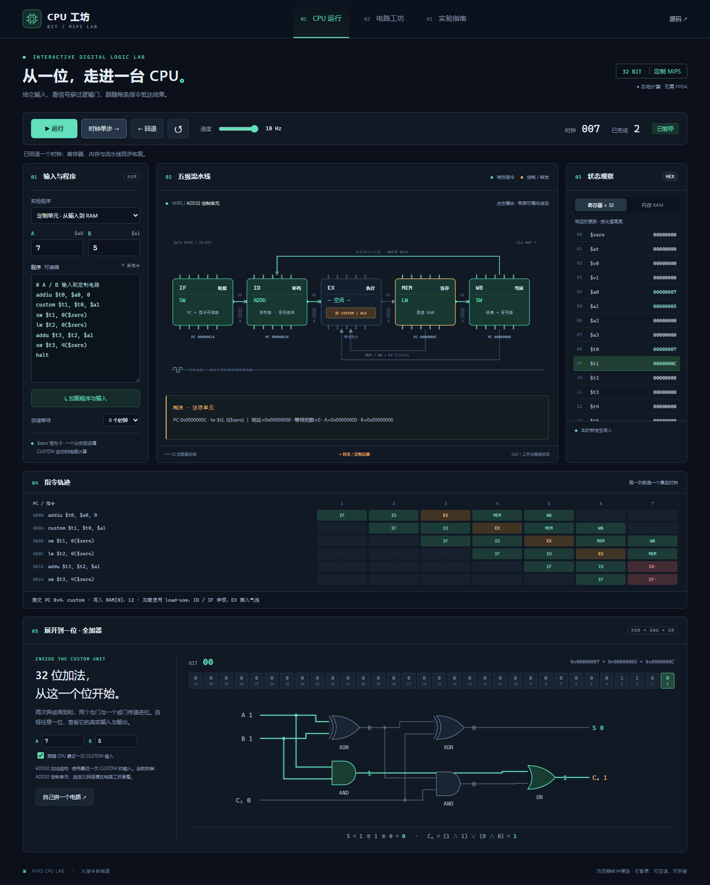
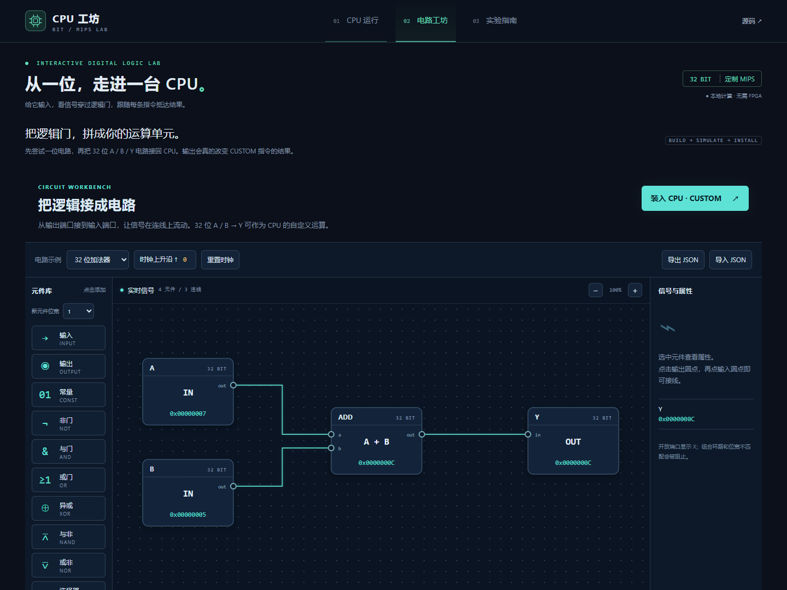

# CPU 工坊：从一位到一台 CPU

这是可以执行程序、观察状态和拼接电路的浏览器实验台。代码在 [lab/](lab/)，本地入口为 `http://127.0.0.1:4173/lab/`。





## 启动与软件

安装 Node.js，在仓库根目录运行：

```powershell
npm run lab
```

打开终端显示的地址即可。静态文件完全本地计算，无 CDN、登录或网络服务依赖；服务只监听本机。运行不需要 Vivado、MARS 或专用 MCP。若已有静态 Web 服务，也可以直接服务 `docs/`；原生 ES modules 需要 HTTP，因此不要双击 HTML 用 `file://` 打开。

真正修改、综合和验证本仓库 FPGA 工程时，仍使用 Vivado / XSim 2019.2。浏览器模型不替代 Verilog 回归与实板测试。

## 五个垂直 capabilities

| 能力 | 从哪里开始 | 可以看到什么 | 可验证结果 |
|---|---|---|---|
| V01 输入到结果 | A/B 与汇编编辑器 | 汇编错误行、指令、寄存器输入 | 默认 7 + 5 写入 RAM[0] = 12，后续结果 RAM[4] = 17 |
| V02 指令到流水线 | 运行、暂停、时钟单步、回退 | IF/ID/EX/MEM/WB、阶段信号、转发、load-use、等待 | 增加存储等待后周期增加，结果不变且无重复副作用 |
| V03 结果到状态 | 寄存器 / RAM 面板 | 32 寄存器、256 字节小端 RAM、写入高亮 | 字节示例把 0x12345678 改为 0x1234AB78 |
| V04 运算到逻辑门 | 位选择条、全加器展开 | A/B/Cin、两级 XOR、AND/OR、Sum/Cout | 0xFFFFFFFF + 1 的最高位输出 carry=1，32 位结果为 0 |
| V05 元件到 CPU | 电路工坊 | 拖动门、端口连线、输入开关、DFF、关卡、导入导出 | 安装 32 位 A/B/Y 网络后，CUSTOM 指令使用该电路计算 |

## 操作路线

1. 默认示例输入 7 和 5，点击「加载程序与输入」。单步看到 PC 逐条进入流水线。
2. 点 EX 模块查看操作数与结果，点 MEM 查看地址。时序表里每一列是一个真实模型时钟；保持在同一级的指令有停顿标记。
3. 切到 RAM 查看地址 0 和 4。运行结束仍可回退，寄存器、RAM 和级间状态一起恢复。最多保留最近 600 拍；轨迹保存最近 100 拍、显示最近 18 拍。
4. 「展开到一位」默认跟随最近一次 CUSTOM 的 A/B。也可直接改输入，单独研究 32 位加法的每一个进位。
5. 在电路工坊选择示例，先点输出端口再点输入端口连线。32 位组合网络需要命名接口 A、B、Y；安装后 CPU 复位，下一次 CUSTOM 使用新网络。

快捷键：空格运行/暂停，N 前进一个时钟，B 回退。输入框和按钮获得焦点时不触发全局快捷键。选择其他模式会暂停 CPU。

## 软件模型边界

支持 44 条普通 MIPS 指令：ADD/ADDU/SUB/SUBU/ADDI/ADDIU；SLT/SLTU/SLTI/SLTIU；AND/OR/XOR/NOR/ANDI/ORI/XORI/LUI；SLL/SRL/SRA/SLLV/SRLV/SRAV；BEQ/BNE/BLEZ/BGTZ/BLTZ/BGEZ/BLTZAL/BGEZAL；J/JAL/JR/JALR；LB/LBU/LH/LHU/LW；SB/SH/SW。接受 LI、MOVE、NOP，以及浏览器扩展 HALT 和 CUSTOM。

一个分支延迟槽、PC+8 链接、32 位无符号保存、带符号比较和扩展、小端字节寻址参与计算。流水线有真实有效级、转发、load-use 气泡、存储等待；快照显示上升沿后的锁存器，位于 WB 的指令在下一拍提交。MEM 完成时更新 RAM。循环的每次动态取指有不同编号。

ADD/ADDI/SUB 溢出、非法地址/对齐、延迟槽内再次控制转移会停止模型并报告错误；这是教学错误处理，不是精确 CP0 异常。UI 在出错时恢复该拍之前的状态。无 CP0、Cache、中断、乘除法/HI-LO、板级外设或传播延迟模拟。

**CUSTOM 为浏览器可替换组合单元，没有加入 FPGA RTL。** 默认是 ADD32，可切换为 XOR32 或自行搭建组合门网络。时钟 DFF 可在电路工坊学习，但不允许安装到组合 CUSTOM 接口。全加器展开区始终展示 ADD32 的内部结构，其他网络的实际结构与信号看电路工坊。

线的颜色标记逻辑值或阶段活动，动画表示逻辑传递，不声称电压、电流、纳秒时序或实际晶体管仿真。旧 `evidence/` 中的 RTL/实板结果与此软件模型分别记录。

## 开发和验证

```powershell
npm run test:visual
python -m unittest tests/test_run_all.py -v
```

引擎测试使用 Node 自带 test runner，无第三方依赖。浏览器回归另需 Playwright，先启动本地服务：

```powershell
npm install --no-save playwright
npx playwright install chromium
npm run test:browser
```

已有 Edge 可设置 `$env:PLAYWRIGHT_CHANNEL = 'msedge'`。测试截图与结果写入被忽略的 `build/visual-lab/`；`PLAYWRIGHT_MODULE` 可指向已有 Playwright 包，`LAB_URL` 可指定其他服务器。

入口职责：`app.js` 管理交互与视图，`engine/cpu.js` 执行指令，`engine/circuit.js` 计算网表，`circuit-editor.js` 管理拼接。无需构建或打包即可修改并刷新。

[本次验证项目与范围](visual-lab-verification.md)
